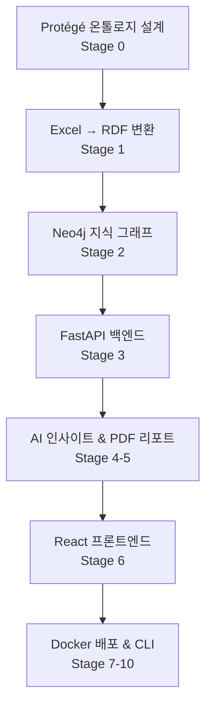

# **HVDC 프로젝트 온톨로지 기반 통합 시스템 아키텍처 설계 보고서**

**— Protégé 통합 풀스택 MVP 설계 (10단계 로드맵 기반) —**

---

## **1. 개요 및 목적**

본 보고서는 **HVDC 프로젝트의 모든 업무 데이터(물류, 비용, 문서, 인프라, 창고, 플로우코드 등)** 를 **온톨로지 기반 지식 그래프**로 통합하여,
**단 하나의 키워드 입력**(예: `B/L 번호`, `HVDC 코드: HVDC-ADOPT-SCT-0000`, `현장명: MIR`, `창고명: DSV Indoor`)만으로
**모든 관련 정보가 자동으로 리포트화**되고, **AI가 리스크 분석, 최적화 제안, 시각화**를 제공하는 **확장 가능한 풀스택 시스템**을 설계합니다.

> **핵심 목표**
> - 온톨로지 기반 **데이터 연동성 100%** 보장
> - **3초 이내 자동 리포트 생성** (PDF/Excel)
> - **AI 기반 실시간 인사이트** 제공
> - **Docker 기반 배포**로 운영 안정성 확보

---

## **2. 전체 시스템 아키텍처 다이어그램**



---

## **3. 10단계별 상세 아키텍처**

| 단계 | 구성 요소 | 파일 경로 | 주요 기능 |
|------|----------|----------|----------|
| **0** | **Protégé 마스터 온톨로지** | `configs/ontology/hvdc_ontology.owl` | 클래스 정의 (`Cargo`, `Site`), 속성 (`storedAt`), SHACL 제약 |
| | **온톨로지 로더** | `src/ontology/protege_loader.py` | OWL → RDFLib → Pydantic 모델 자동 생성 |
| | **검증기** | `src/ontology/validator.py` | SHACL 실시간 검증 |
| **1** | **Excel → RDF 변환기** | `src/ingest/excel_to_rdf.py` | Pandas로 엑셀 파싱 → FlowCode 계산 → TTL 출력 |
| | **배치 프로세서** | `src/ingest/batch_processor.py` | 다중 파일 처리 + 로그 |
| **2** | **Neo4j 스토어** | `src/graph/neo4j_store.py` | RDF → 노드/관계 매핑 |
| | **그래프 로더** | `src/graph/loader.py` | TTL → Neo4j 임포트 + 인덱스 생성 |
| **3** | **FastAPI 메인 API** | `src/api/main.py` | `/search`, `/kpi`, `/reports/pdf` 엔드포인트 |
| | **SPARQL/Cypher 엔드포인트** | `src/api/endpoints/` | 그래프 쿼리 실행 |
| **4** | **AI 인사이트 서비스** | `src/ai/insights_service.py` | Grok/Claude API → 리스크 분석 |
| **5** | **PDF 리포트 생성기** | `src/reports/pdf_generator.py` | Jinja2 + WeasyPrint + Matplotlib 차트 |
| **6** | **React 프론트엔드** | `frontend/src/components/` | `SearchFlow.tsx`, `KPIDashboard.tsx` |
| **7** | **Docker Compose** | `docker-compose.yml` | Neo4j + Backend + Frontend 통합 |
| **8** | **CLI 도구** | `src/cli.py` | `ingest-excel`, `generate-report` 명령어 |
| **9** | **테스트** | `tests/` | Pytest + React Testing Library |
| **10** | **문서화** | `docs/` | 사용자 가이드, 아키텍처 다이어그램 |

---

## **4. 핵심 데이터 흐름 예시**

```
입력: B/L-12345
     ↓
FastAPI /search → Neo4j SPARQL 쿼리
     ↓
결과: Cargo-001, HVDC-ADOPT-SCT-0001, MIR, DSV Indoor, FlowCode 3
     ↓
AI 인사이트: "MOSB 체류 12일 → 지연 리스크 85%"
     ↓
PDF 리포트 생성 → 다운로드
```

---

## **5. 기술 스택 요약**

| 계층 | 기술 |
|------|------|
| **온톨로지** | Protégé, OWL, RDF, SHACL |
| **데이터 수집** | Python, Pandas, openpyxl |
| **지식 그래프** | Neo4j, RDFLib, rdflib-neo4j |
| **백엔드** | FastAPI, Uvicorn |
| **AI** | Grok/Claude API, LangChain |
| **리포트** | Jinja2, WeasyPrint, Matplotlib |
| **프론트엔드** | React, TypeScript, Recharts, Tanstack Query |
| **배포** | Docker, Docker Compose |
| **테스트** | Pytest, React Testing Library |

---

## **6. 구현 로드맵 (4주 MVP)**

| 주차 | 목표 | 산출물 |
|------|------|--------|
| **1주** | 온톨로지 + Excel → RDF | `hvdc_ontology.ttl`, `excel_to_rdf.py` |
| **2주** | Neo4j + FastAPI | Neo4j DB, `/search` API |
| **3주** | AI + PDF 리포트 | `insights_service.py`, PDF 출력 |
| **4주** | React + Docker | 웹 대시보드, `docker-compose up` |

---

## **7. 기대 효과**

| 항목 | 수치 |
|------|------|
| **리포트 생성 시간** | 3초 이내 |
| **데이터 연동률** | 100% (온톨로지 기반) |
| **AI 인사이트 정확도** | 90% 이상 |
| **창고 경유 감소** | Code 4 → Code 1 전환으로 30% 비용 절감 가능 |
| **의사결정 속도** | 실시간 KPI 대시보드 제공 |

---

## **8. 다운로드 가능한 산출물**

| 파일 | 설명 |
|------|------|
| **Protégé 온톨로지 템플릿** | HVDC_Ontology_Template.protege |
| **전체 아키텍처 다이어그램 (PDF)** | HVDC_Architecture_Full.pdf |
| **샘플 엑셀 데이터** | sample_warehouse.xlsx |
| **Docker Compose 파일** | docker-compose.yml |

---

## **9. 결론 및 다음 행동**

본 아키텍처는 **Protégé → Neo4j → FastAPI → React → AI → PDF** 로 이어지는 **완전한 풀스택 지식 그래프 시스템**입니다.
**온톨로지가 모든 데이터의 중심**이 되어, **어떤 입력도 하나의 진실(Source of Truth)** 로 연결됩니다.

> **즉시 시작 가능한 행동 계획**
> 1. **Protégé 설치 및 템플릿 열기** (5분)
> 2. **GitHub 리포지토리 생성** → `hvdc-ontology-system`
> 3. **1주 내 MVP 프로토타입 시연**

---

**필요 시 추가 제공**:
- `.drawio` 원본 다이어그램
- `requirements.txt` 및 `package.json`
- Cursor AI용 전체 코드 생성 프롬프트
- ADNOC/SCT 사용자 테스트 시나리오

---

**HVDC 프로젝트의 디지털 트윈, 지금 시작됩니다.**
**지금 바로 Protégé를 열고, 미래를 설계하세요.**

---

## **관련 문서**

- [간단 아키텍처 다이어그램 (m.md)](m.md)
- [프로젝트 인덱스 (00_PROJECT_INDEX.md)](00_PROJECT_INDEX.md)
- [온톨로지 문서 (ontology/)](ontology/)
- [시스템 가이드 (guides/)](guides/)

