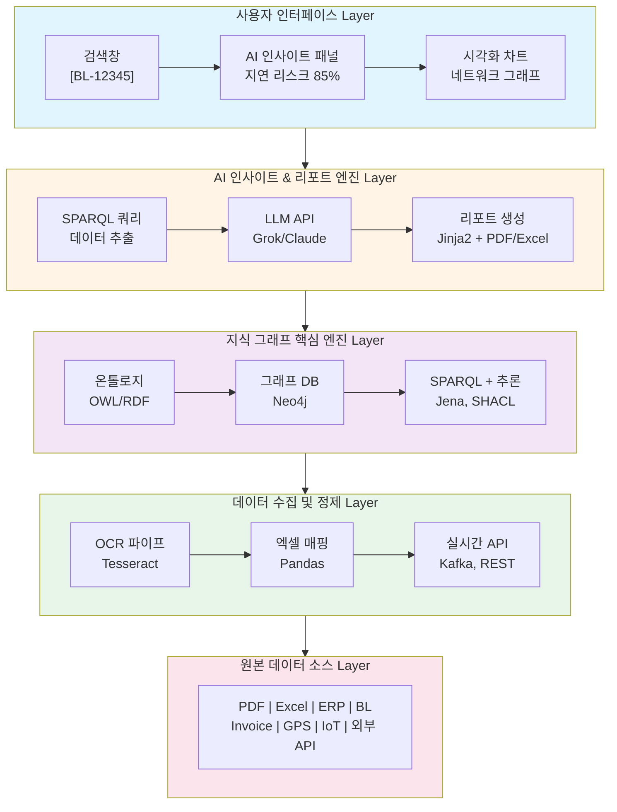

┌─────────────────────────────────────────────────────────────────┐
│                     사용자 인터페이스 (Web Dashboard)            │
│  ┌───────────────┐   ┌──────────────────────┐   ┌──────────────┐ │
│  │  검색창       │   │   AI 인사이트 패널     │   │  시각화 차트  │ │
│  │ [BL-12345]    │→ │ "지연 리스크 85%"     │→ │ 네트워크 그래프│ │
│  └───────────────┘   └──────────────────────┘   └──────────────┘ │
└─────────────────────────────────────────────────────────────────┘
                             ↓
┌─────────────────────────────────────────────────────────────────┐
│                 AI 인사이트 & 리포트 엔진                        │
│  - SPARQL 쿼리 → 데이터 추출                                    │
│  - LLM (Grok API) → 자연어 인사이트 생성                        │
│  - Jinja2 → PDF/Excel 자동 생성                                 │
└─────────────────────────────────────────────────────────────────┘
                             ↓
┌─────────────────────────────────────────────────────────────────┐
│                    지식 그래프 핵심 엔진 (KG Core)              │
│  ┌─────────────┐  ┌──────────────┐  ┌───────────────────────┐   │
│  │  온톨로지    │  │  그래프 DB    │  │  SPARQL + 추론 엔진     │   │
│  │ (OWL/RDF)   │  │ (Neo4j)      │  │ (Jena, SHACL 검증)      │   │
│  └─────────────┘  └──────────────┘  └───────────────────────┘   │
└─────────────────────────────────────────────────────────────────┘
                             ↓
┌─────────────────────────────────────────────────────────────────┐
│                   데이터 수집 및 정제 계층                       │
│  ┌─────────────┐  ┌──────────────┐  ┌───────────────────────┐   │
│  │  OCR 파이프  │  │  엑셀 매핑   │  │  실시간 API 연동       │   │
│  │ (Tesseract) │  │ (Pandas)     │  │ (Kafka, REST)          │   │
│  └─────────────┘  └──────────────┘  └───────────────────────┘   │
└─────────────────────────────────────────────────────────────────┘
                             ↓
┌─────────────────────────────────────────────────────────────────┐
│                        원본 데이터 소스                          │
│  PDF | Excel | ERP | BL | Invoice | GPS | IoT | 외부 API       │
└─────────────────────────────────────────────────────────────────┘

---

## Mermaid 버전 (5계층 아키텍처)

**설명**:
- **Layer 1 (사용자 인터페이스)**: 웹 대시보드를 통한 검색, AI 인사이트, 시각화
- **Layer 2 (AI 엔진)**: SPARQL 쿼리 → LLM 분석 → 자동 리포트 생성
- **Layer 3 (지식 그래프)**: 온톨로지 기반 그래프 DB, SPARQL 추론 엔진
- **Layer 4 (데이터 정제)**: OCR, 엑셀 파싱, 실시간 API 연동
- **Layer 5 (데이터 소스)**: 다양한 원본 데이터 (PDF, Excel, ERP 등)

---

**관련 문서**:
- [전체 시스템 아키텍처 보고서](HVDC_System_Architecture.md) - 10단계 상세 설계
- [프로젝트 인덱스](00_PROJECT_INDEX.md) - 모든 문서 통합 인덱스
